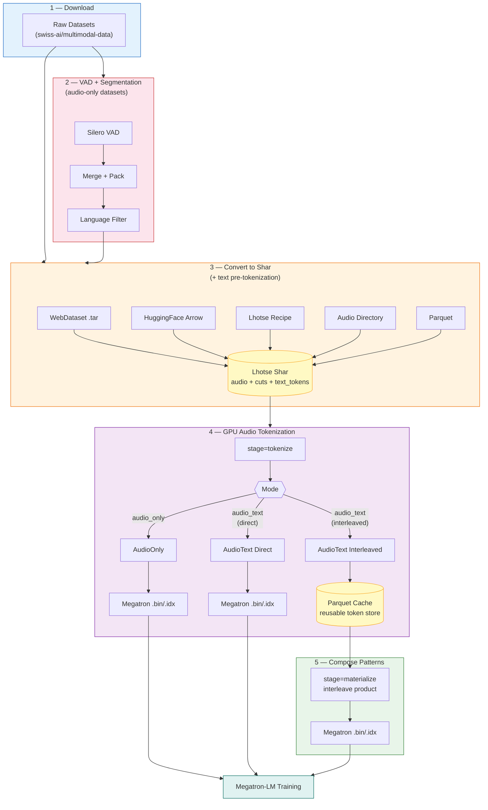
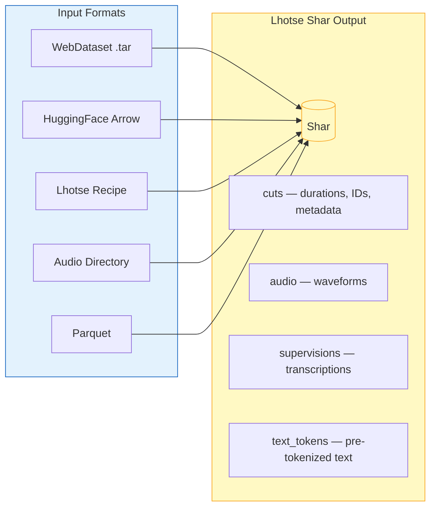
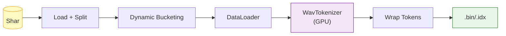
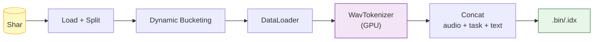
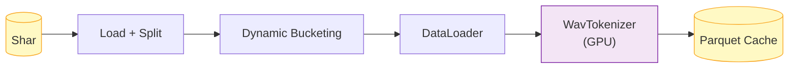
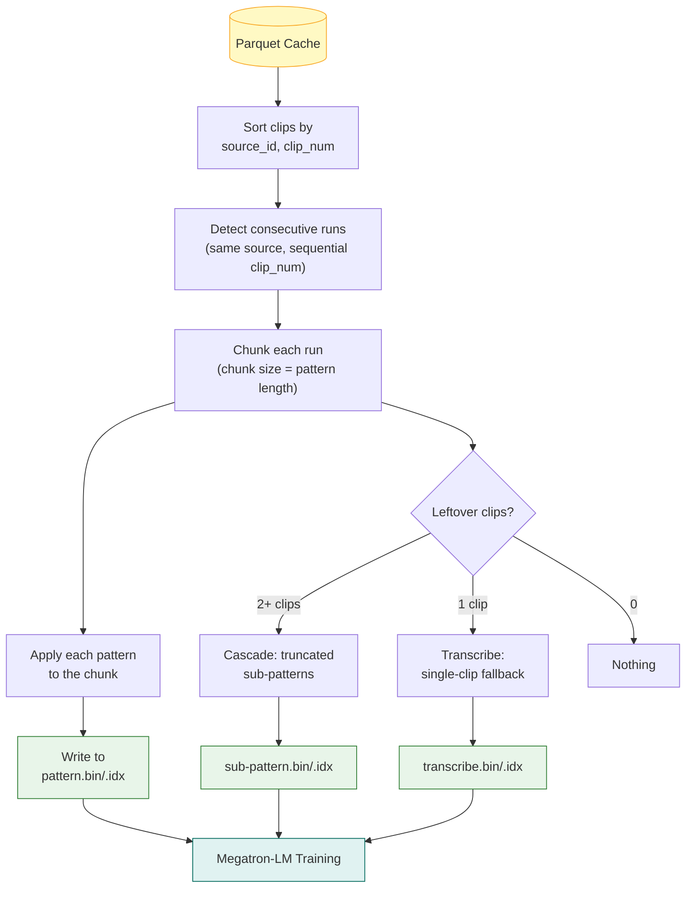
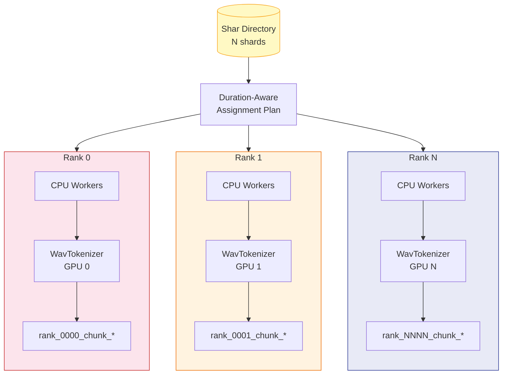

# Audio Tokenization Pipeline — Architecture Overview

> **TL;DR** — Download raw audio datasets, preprocess with VAD (audio-only) or use pre-segmented data (audio-text), convert everything to Lhotse Shar, tokenize audio on GPUs, and output Megatron-compatible `.bin/.idx` for training. The interleaved path caches tokens to Parquet so you can cheaply compose different cross-clip interleaving patterns without re-tokenizing.

---

## 1. End-to-End Pipeline

The pipeline spans two repositories: dataset downloading ([multimodal-data](https://github.com/swiss-ai/multimodal-data/tree/data-pipeline/adapter)) and tokenization (this repo). All paths produce Megatron `.bin/.idx` files for training.



---

## 2. VAD + Segmentation (Audio-Only Datasets)

Unsupervised datasets (e.g. VoxPopuli, People's Speech) contain long recordings with silence. Before converting to Shar:

| Step | Script | What it does |
|------|--------|-------------|
| **Silero VAD** | [`run_vad.py`](./prepare/preprocess/run_vad.py) | Detect speech timestamps per recording |
| **Merge + Pack** | [`chunking.py`](./prepare/preprocess/chunking.py) | Merge segments when gap < `max_merge_gap_sec`, pack into chunks up to `max_chunk_sec`, drop chunks < `min_chunk_sec` |
| **Language Filter** | [`filter_langid_vad.py`](./prepare/preprocess/filter_langid_vad.py) | Keep only target languages, produce per-shard VAD JSONL |

Audio-text datasets (e.g. Emilia, WenetSpeech) are already segmented with transcriptions and skip this step.

> **Dry run:** Sweep VAD parameters and estimate hours/tokens per configuration with [`vad_sweep.py`](./prepare/stats/vad_sweep.py) — no files written.
>
> ```bash
> python -m audio_tokenization.prepare.stats.vad_sweep \
>     --vad-dir /path/to/vad_results \
>     --min-chunk-sweep 1,5,10,20,30 \
>     --token-rate 40 --num-workers 32
> ```

---

## 3. Convert to Shar

All input formats converge into **Lhotse Shar** before tokenization. Each converter is a standalone script under [`prepare/`](./prepare/).

**Text pre-tokenization happens here** (via `--text_tokenizer`): the Shar stores `text_tokens` per cut, so the GPU tokenization step only handles audio.



**SoXR is our chosen CPU resampler.** Keep `resampling_backend: soxr`, the existing [conversion default](./configs/pipeline/convert/_common.yaml). It was faster than Lhotse's Torch resampler in our GH200 preparation measurements:

| Input | SoXR | Torch resampler |
|---|---:|---:|
| 60-second stereo WAV, 48 → 24 kHz | **99 ms** | 206 ms |
| 30-second MP3 excerpt | **53 ms** | 124 ms |
| 30-second Opus excerpt | **191 ms** | 254 ms |

These are median preparation times in NeMo 25.11 with the current Lhotse/TorchAudio dependencies, one CPU thread, the same optimized pipeline, and transparent huge pages disabled. They include decoding, channel resampling, downmix, and intermediate FLAC encoding; they exclude source-file I/O and GPU tokenization. This comparison supports our CPU performance choice, without making a comparative audio-quality claim.

Single-source multichannel downmix decodes the source once per cut, then uses Lhotse's sequential channel transforms, downmix, and FLAC encoding. The decoded source is released when downmix finishes, including on failure; first-channel fallback retains the original cut. The optimization preserves the existing SoXR output.

On Linux, `run ... stage=convert` disables transparent huge pages before loading stage code, and conversion workers inherit the setting. This avoids large resident-memory jumps on GH200 nodes with 512 MiB huge pages. Set `AUDIO_PREPARE_DISABLE_THP=0` to keep the inherited policy when profiling. Other commands and stages do not set this policy.

---

## 4. GPU Audio Tokenization

All modes share the same data loading pipeline ([`data.py`](./pipelines/lhotse/data.py)): load Shar, derive a duration-aware rank assignment from `_shar_work_manifest.json`, dynamic bucketing by duration, multi-worker CPU decoding, GPU tokenization with WavTokenizer.

> **`trim_last_tokens`** — Batched GPU tokenization zero-pads shorter waveforms to the longest waveform in the batch. We observed that zero-padded vs. non-padded audio is stable except for the last few positions near the padding boundary. The `trim_last_tokens` config strips those trailing tokens only from samples that were actually batch-padded. See [`audio_only.py`](./vokenizers/wavtokenizer/audio_only.py).

### Mode A: Audio-Only

[`audio_only.py`](./pipelines/lhotse/audio_only.py) — Encode waveforms into discrete tokens, wrap with structure tokens, write Megatron micro-shards.



```
Output: [BOS] [audio_start] tok_0 ... tok_N [audio_end] [EOS]
```

### Mode B: Audio-Text Direct

[`audio_text.py`](./pipelines/lhotse/audio_text.py) with `audio_text_format: direct` — Concatenate audio tokens + task token + text tokens into a single sequence.



```
Output: [BOS] [audio_start] audio_toks [audio_end] [task] text_toks [EOS]
```

### Mode C: Audio-Text Interleaved (Two-Stage)

The interleaved path separates the expensive GPU tokenization (Stage 1) from the cheap CPU-only pattern composition (Stage 2), so you can experiment with different interleaving strategies without re-tokenizing.

---

## 5. What is Cross-Clip Interleaving?

Speech data is inherently multimodal: the same spoken content produces completely different token sequences depending on the modality — discrete audio tokens from WavTokenizer (variable-length, acoustic) vs. text tokens from a text tokenizer (short, semantic). **Interleaving** arranges these two representations from *different* temporal positions within a recording into a single training sequence:

```
Aligned timeline (one recording, 8 clips of ~5s each):

  Text:   T1    T2    T3    T4    T5    T6    T7    T8
  Audio:  A1    A2    A3    A4    A5    A6    A7    A8
          |     |     |     |     |     |     |     |
  Time:   0s    5s    10s   15s   20s   25s   30s   35s

  Each clip has BOTH audio tokens and text tokens for the same content.
  A pattern selects which representation to use at each position.
```

**Bidirectional interleaving** (ATAT + TATA) creates two complementary views of the same recording:

```
  Audio-first (ATAT):  A1 → T2 → A3 → T4 → A5 → T6 → ...
                        ↑         ↑         ↑
                      audio     audio     audio    (odd positions)
                             ↑         ↑
                           text      text          (even positions)

  Text-first  (TATA):  T1 → A2 → T3 → A4 → T5 → A6 → ...
                        ↑         ↑         ↑
                      text      text      text     (odd positions)
                             ↑         ↑
                           audio     audio         (even positions)
```

| Property | Benefit |
|----------|---------|
| **Full coverage** | Every temporal position appears as both audio and text across the two patterns |
| **Bidirectional alignment** | Model learns audio-to-text *and* text-to-audio prediction |
| **2x training signal** | Two complementary sequences from a single recording |

### Design Dimensions

- **Sequence length** — How many clips per training sequence (L=4, 8, 16, 32). Longer sequences give more context but cost more memory.
- **Audio granularity** — Concatenate adjacent audio clips to vary the audio-to-text ratio. E.g. `AAT` uses 2 audio clips before each text position, trading fine-grained alignment for richer acoustic context.
- **Unimodal baselines** — `AAAA` (audio-only) and `TTTT` (text-only) patterns from the same Parquet cache for controlled ablation.

### References

- [Scaling Speech-Text Pre-training with Synthetic Interleaved Data](http://arxiv.org/abs/2411.17607) (Zeng et al., 2024)
- [SLAMMING: Training a Speech Language Model on One GPU in a Day](http://arxiv.org/abs/2502.15814) (Maimon et al., 2025)
- [Kimi-Audio Technical Report](https://arxiv.org/abs/2504.18425) (KimiTeam, 2025)
- [Voxtral](https://arxiv.org/abs/2507.13264) (Liu et al., 2025)

---

## 6. Interleaved Pipeline — Implementation

### Stage 1: Tokenize to Parquet Cache (GPU)

[`audio_text.py`](./pipelines/lhotse/audio_text.py) with `audio_text_format: interleaved` — Tokenize audio on GPU, pair with pre-tokenized text, write per-clip rows to Parquet.



Each Parquet row stores one clip:

| Column | Description |
|--------|-------------|
| `clip_id` | Unique clip identifier |
| `source_id` | Source recording / utterance group |
| `clip_num` | Sequential position within source |
| `speaker` | Speaker identifier |
| `duration` | Audio duration (seconds) |
| `text` | Raw transcription |
| `text_tokens` | Pre-tokenized text (int32 list) |
| `audio_tokens` | WavTokenizer output (int32 list) |
| `dataset` | Dataset name |

### Stage 2: Compose Patterns (CPU-only)

`stage=materialize` reads the interleave cache and assembles final Megatron training sequences. **No GPU needed** — re-run materialization when sequence policy changes; re-tokenization is not required.

Assembly reads memory-mapped token spans and writes one sequence at a time. Dry-run estimates use the same packing iterator. The indexed writer writes contiguous arrays directly and converts their dtype only when needed.



> **Dry run:** Pass `--dry-run` to preview per-pattern statistics (sequence counts, token counts, estimated `.bin` size, length distributions) without writing files.

---

### Worked Example

A podcast episode with 9 clips, `--patterns ATAT TATA`:

**Step 1 — Detect runs.** Consecutive `clip_num` values from the same `source_id` form a run:

```
Source: podcast_ep42    →  one run of 9 clips: [c0, c1, c2, c3, c4, c5, c6, c7, c8]
```

**Step 2 — Chunk the run.** Pattern length = 4, so chunk size = 4 (non-overlapping). The number of full chunks is `run_length // chunk` and the remainder is `run_length % chunk`:

```
9 // 4 = 2 full chunks,  9 % 4 = 1 remainder clip

Chunk 1:   [c0, c1, c2, c3]
Chunk 2:   [c4, c5, c6, c7]
Remainder: [c8]              ← doesn't fill a chunk
```

**Step 3 — Apply patterns.** Each character maps a clip to a modality (`A` = audio tokens, `T` = text tokens). A `[switch]` token is inserted at every A-to-T transition:

```
ATAT on [c0, c1, c2, c3]:
         A       T       A       T
  → [BOS, audio(c0), switch, text(c1), audio(c2), switch, text(c3), EOS]

TATA on [c0, c1, c2, c3]:
         T       A       T       A
  → [BOS, text(c0), audio(c1), switch, text(c2), audio(c3), EOS]
```

**Step 4 — Handle remainder.** 1 clip left → `transcribe` fallback:

```
[BOS, audio(c8), speech_transcribe, text(c8), EOS]  →  transcribe.bin/.idx
```

For 2-3 leftover clips, **cascade sub-patterns** (truncated prefixes) handle them:

```
Main patterns:     ATAT, TATA  (chunk=4)
Cascade (size 3):  ATA,  TAT   (first 3 chars)
Cascade (size 2):  AT,   TA    (first 2 chars)
Single-clip:       transcribe
```

### Pattern Reference

| Pattern | Clips | Output Sequence |
|---------|-------|-----------------|
| `AT` | 2 | `[BOS] A(c0) [switch] T(c1) [EOS]` |
| `TA` | 2 | `[BOS] T(c0) A(c1) [EOS]` |
| `ATAT` | 4 | `[BOS] A(c0) [switch] T(c1) A(c2) [switch] T(c3) [EOS]` |
| `TATA` | 4 | `[BOS] T(c0) A(c1) [switch] T(c2) A(c3) [EOS]` |
| `AAT` | 3 | `[BOS] A(c0) A(c1) [switch] T(c2) [EOS]` |
| `AAAA` | 4 | `[BOS] A(c0) A(c1) A(c2) A(c3) [EOS]` (audio-only baseline) |
| `TTTT` | 4 | `[BOS] T(c0) T(c1) T(c2) T(c3) [EOS]` (text-only baseline) |

- **A** = audio tokens for that clip (`[audio_start] ... [audio_end]`)
- **T** = text tokens for that clip
- **[switch]** = `<|speech_switch|>` token, only at A-to-T transitions

### CLI Usage

```bash
# Stage 1: Tokenize once (expensive, GPU)
python -m audio_tokenization run dataset=cooldown/infore2 stage=tokenize

# Stage 2: materialize final interleave product (cheap, CPU-only)
python -m audio_tokenization run dataset=cooldown/infore2 stage=materialize
```

---

## 7. Configuration (Hydra)

The pipeline uses [Hydra](https://hydra.cc/) for hierarchical configuration. The root config is intentionally thin: `stage/*` selects the runnable stage, `runtime/*` carries operational knobs, and `dataset/*` is the canonical typed dataset spec.

```
configs/pipeline/
├── config.yaml                       # stage + runtime + dataset composition
├── convert/*.yaml                    # reusable conversion profiles
├── tokenize/*.yaml                   # reusable tokenization profiles
├── materialize/*.yaml                # reusable product profiles
├── stage/*.yaml                      # convert/tokenize/materialize/all
└── dataset/{sft,cooldown,stage1,stage2,internal}/*.yaml
                                      # one canonical spec per dataset
```

**Dataset specs** configure the enabled stages directly:

| Key | Description |
|-----|-------------|
| `convert.*` | Raw source, conversion metadata, SHAR output, workers |
| `tokenize.*` | SHAR input, tokenizer, filters, bucketing, DataLoader |
| `materialize.interleave.*` | Interleave cache input and final sequence output |
| `runtime.overwrite` | Delete and rebuild an existing stage output instead of skipping `_SUCCESS` |

```bash
# Override from CLI
python -m audio_tokenization run \
    dataset=stage1/suno_s1 \
    stage=tokenize \
    dataset.tokenize.tokenizer.trim_last_tokens=0 \
    dataset.tokenize.dataloader.max_batch_duration=2000
```

---

## 8. Multi-GPU Distribution

Each rank processes an independent planned SHAR work subset — no NCCL, no inter-rank communication. Conversion writes `_shar_work_manifest.json`; tokenization writes `_tokenize_assignment.json` for the current launch. See [`planning.py`](./pipelines/lhotse/planning.py) and [`core.py`](./pipelines/lhotse/core.py).

Durable SHAR work manifests use schema 3: roots are relative to the manifest location, and companion fields are relative to their owning root. The planner validates index digests, field pairing, and coverage of every requested root before reuse. Missing, partial, stale, or legacy schema 2 manifests trigger a metadata scan of all requested roots without rewriting the input dataset. Launch snapshots and assignments remain schema 2 with resolved paths for auditing. Index validation assumes prepared shard contents are immutable; it does not hash audio or cut payloads.

Assignment sorts whole SHAR units by cut path and preserves their declared companion pairs. Loading uses Lhotse's public `CutSet.from_shar` auto reader selection and logs `reader_mode=indexed` or `reader_mode=streaming`. Existing shuffle behavior is preserved: streaming shuffles shards, while indexed inputs use Lhotse's indexed cut shuffle. Worker partitioning remains disabled because each rank already owns its planned units.




Tokenization stops on inference, write, or finalization errors, including CUDA OOM. It records failed-rank stats and does not publish `_SUCCESS`. `failed_cut_ids` identifies the failed batch (or pending cuts on final flush); `affected_cut_ids` includes cuts since the last completed writer rotation. Some affected cuts may already have been published if a multi-file commit failed partway through, so processing counters are not durable-output counts. Cleanup removes unfinished chunks and preserves chunks with a commit marker. A partial stage requires a fresh output path or an explicit rebuild with `runtime.overwrite=true`; chunk rotation does not save sampler state.

Preparation uses public Lhotse writers inside a private sibling directory, closes and structurally validates each partition, then publishes it with a directory rename. The SHAR payload format remains `cuts.*.jsonl.gz` and `recording.*.tar`; Lhotse may add `.tar.idx` sidecars. Compressed cuts still use streaming: indexed random access requires uncompressed JSONL and TAR files with matching indexes. Work-manifest schema 3 is independent of the SHAR payload format.

Preparation collects planning statistics during that structural pass. Each nonempty partition stores `shar_index.idx` and `_shar_work_manifest.idx`: JSON completion metadata using the existing index and planning schemas. Their suffix keeps them out of Lhotse's field discovery. Root completion checks coverage and file identities before reusing this metadata, so fresh outputs need one cut-manifest pass. Legacy, copied or changed partitions undergo structural validation again, using the existing worker pool. The standalone validation command always performs a full check.
